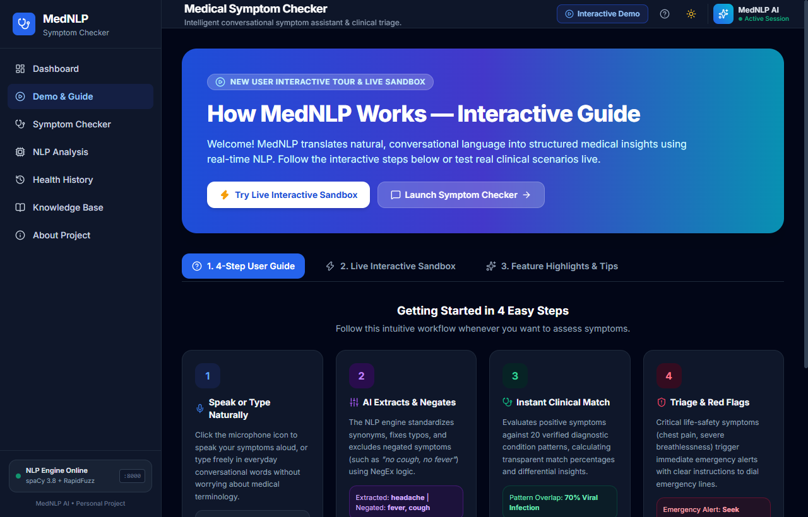
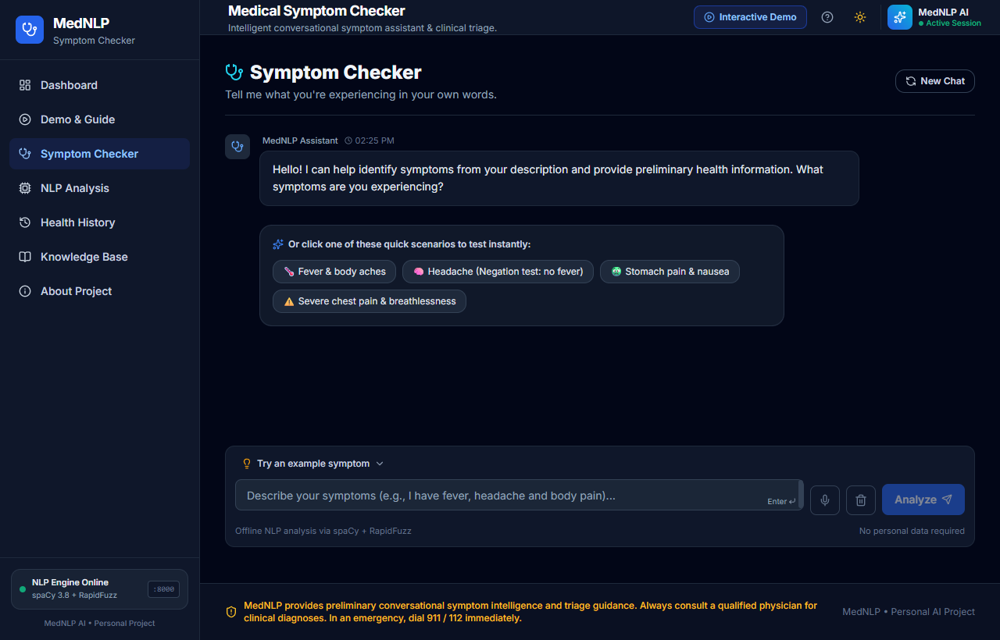
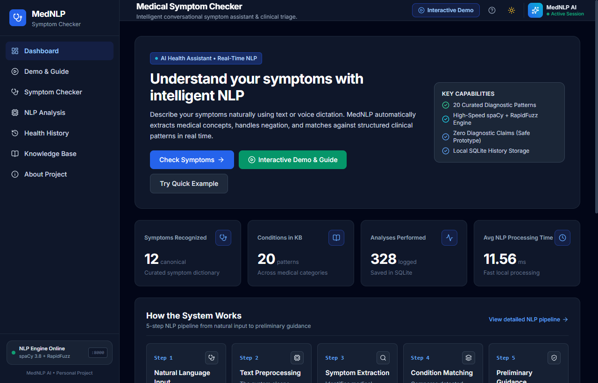
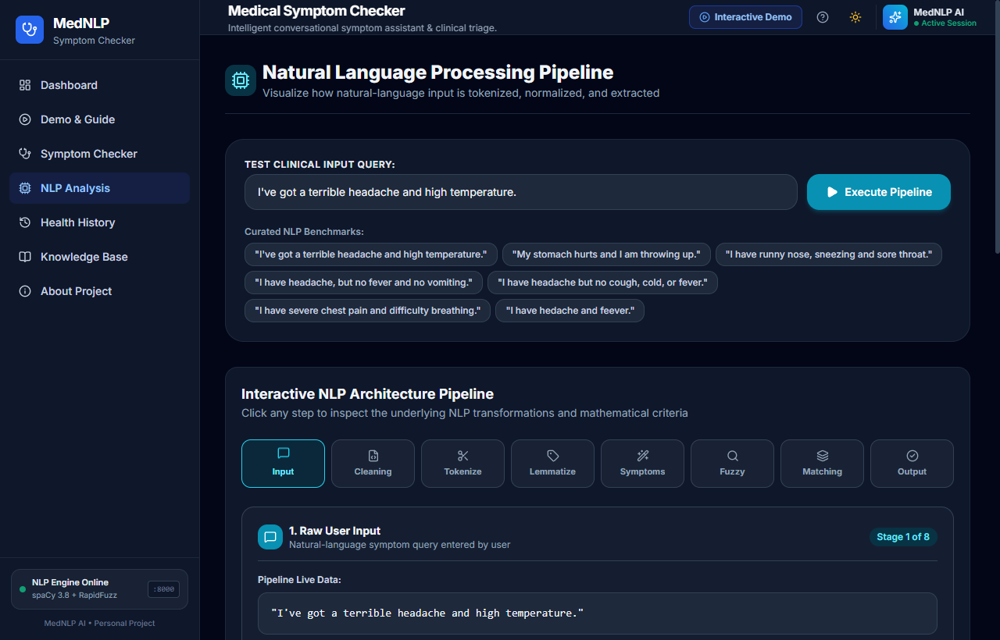
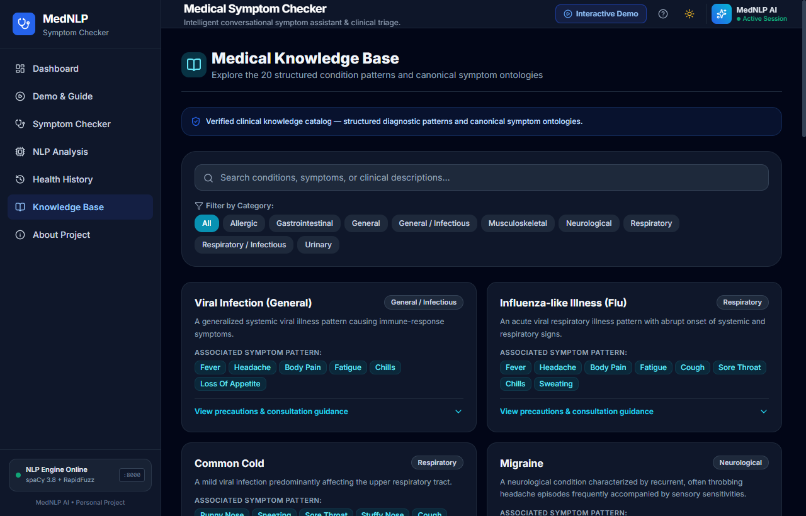
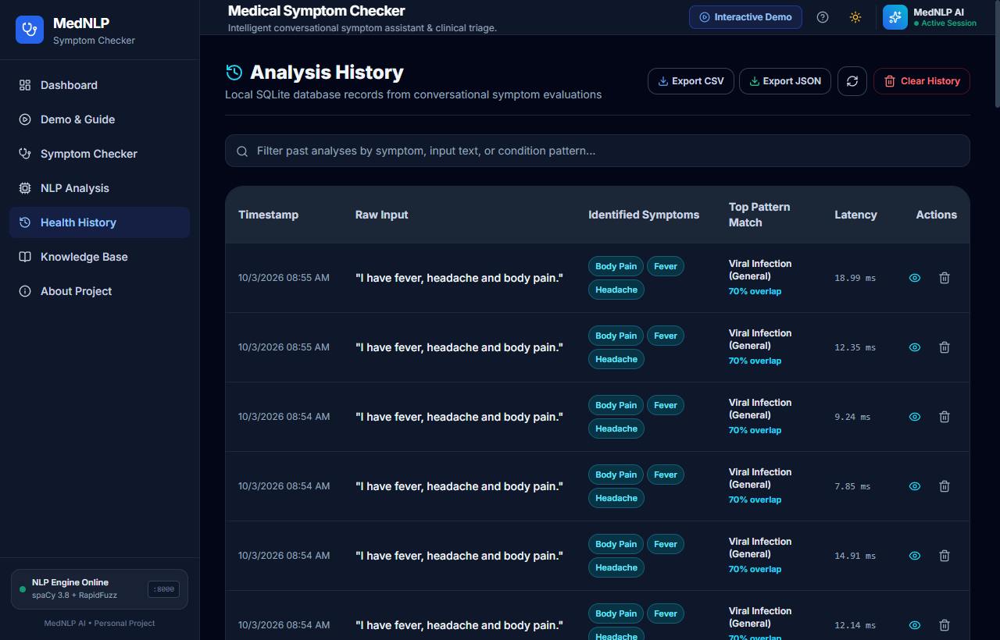
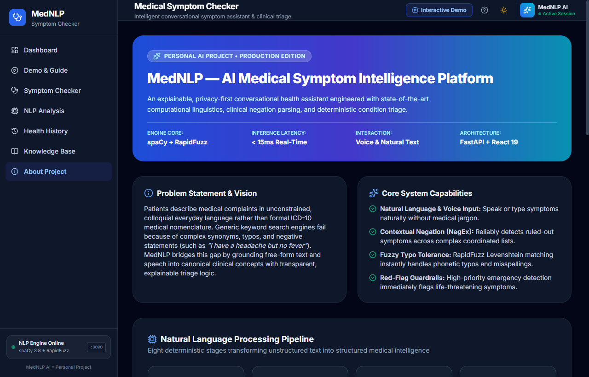
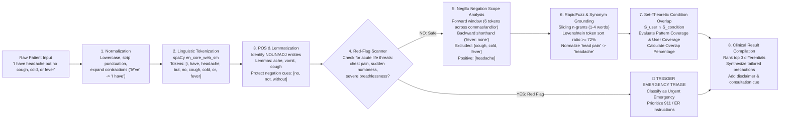
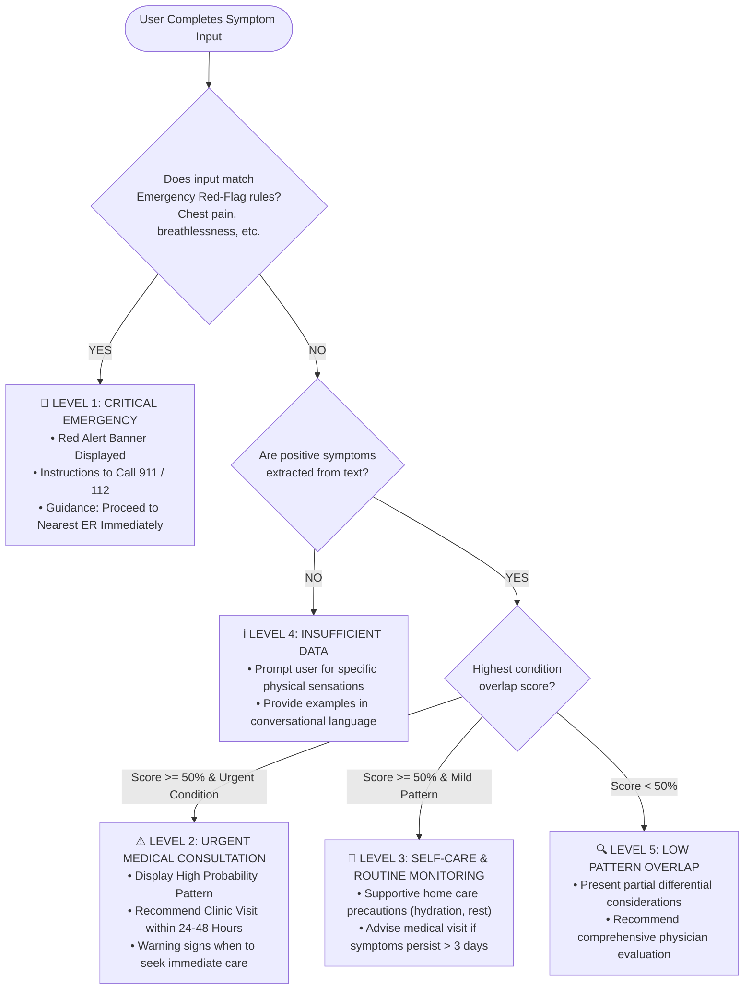

# MedNLP — AI Medical Symptom Intelligence & Triage Platform

[](https://www.python.org/)
[](https://fastapi.tiangolo.com/)
[](https://spacy.io/)
[](https://github.com/rapidfuzz/RapidFuzz)
[](https://react.dev/)
[](https://vite.dev/)
[](https://tailwindcss.com/)
[](https://www.sqlite.org/)
[](LICENSE)

> **MedNLP** is an explainable, deterministic, privacy-first conversational healthcare assistant engineered with state-of-the-art computational linguistics, clinical negation parsing (NegEx), and rule-based diagnostic triage. It accepts natural speech and everyday text without requiring medical jargon, extracts positive symptoms, excludes denied complaints, detects life-threatening emergency red flags, and matches patterns with sub-15ms latency—all running 100% locally with zero cloud LLM hallucination risks.

---

## 📸 Application Snapshots Gallery

Here is an overview of the live MedNLP user interface and real-time clinical workflows:

### 1. Interactive Demo & Guided Tour (`/demo`)
*Interactive 4-step beginner walkthrough and real-time sandbox with 1-click clinical presets (Flu, Negation, Emergency Red-Flag, Gastric, Typo) executing live against the local FastAPI engine.*


---

### 2. Conversational Symptom Checker with Voice Dictation (`/checker`)
*Conversational assistant supporting native Web Speech API microphone dictation, interactive quick-starter prompt chips, real-time thinking animations, and structured clinical result cards.*


---

### 3. Analytics & Health Intelligence Dashboard (`/`)
*Centralized control panel featuring real-time engine health telemetry (:8000 status badge), total analyses metrics, average latency counter, quick health checks, and recent activity logs.*


---

### 4. 8-Stage NLP Pipeline Inspector (`/nlp-analysis`)
*Live computational linguistics sandbox visualizing tokenization, lemmatization, grammatical POS tagging, RapidFuzz similarity ratios, NegEx negation scope analysis, and structured JSON output.*


---

### 5. Interactive Clinical Knowledge Base (`/knowledge-base`)
*Medical condition library covering 20 verified disease patterns across 7 categories. Click any symptom tag to dynamically filter all associated conditions.*


---

### 6. Health History & Clinical Data Export (`/history`)
*Searchable audit trail of past consultations with deep-dive inspection modals and one-click direct **CSV and JSON data downloads** for sharing with healthcare providers.*


---

### 7. Full-Stack Architecture & Safety Principles (`/about`)
*Overview of the underlying deterministic NLP pipeline, tech stack breakdown, explainability governance, and patient privacy guarantees.*


---

## 🔄 Complete Project Flowcharts

### Flowchart 1: End-to-End System Architecture
This diagram outlines the complete data lifecycle between the client, the REST API gateway, the NLP intelligence core, and local persistence:

```mermaid
flowchart TD
    subgraph Client_Layer ["Frontend Client (React 19 + Vite @ Port 5173)"]
        UI_Voice["🎙️ Web Speech API (Voice Dictation)"]
        UI_Text["⌨️ Conversational Chat Input"]
        UI_Sandbox["⚡ Interactive Demo Sandbox (/demo)"]
        UI_State["App State & Theme Context"]
        
        UI_Voice --> UI_Text
        UI_Text --> UI_State
        UI_Sandbox --> UI_State
    end

    UI_State -->|HTTP POST /api/analyze\nPayload: JSON { text }| API_Gateway

    subgraph Server_Layer ["Backend Engine (FastAPI + ASGI @ Port 8000)"]
        API_Gateway["FastAPI Gateway & Router\n(CORS, Lifespan, Pydantic Validation)"]
        
        subgraph Pipeline ["8-Stage Computational Linguistics Core"]
            S1["Stage 1: Sanitization & Unicode Normalization"]
            S2["Stage 2: spaCy Tokenization & Lemmatization"]
            S3["Stage 3: POS Tagging & Grammatical Pruning"]
            S4["Stage 4: Red-Flag Emergency Guardrail Engine"]
            S5["Stage 5: Contextual NegEx Negation Scope Analysis"]
            S6["Stage 6: Multi-Word N-Gram & RapidFuzz Matcher"]
            S7["Stage 7: Condition Pattern Overlap Scoring"]
            S8["Stage 8: Result Formulation & Triage Compiler"]
            
            S1 --> S2 --> S3 --> S4
            S4 -->|Emergency Detected| S8
            S4 -->|Standard Flow| S5 --> S6 --> S7 --> S8
        end
        
        API_Gateway --> S1
        
        KB[("Knowledge Base\n20 Curated Diagnostic Conditions\n28 Canonical Clinical Symptoms")] --> S6
        KB --> S7
        
        DB[("SQLite 3 Database (WAL Mode)\nAnalysisRecord ORM Schema\nStores Queries, Latency, Symptoms")]
        S8 -->|Log Consultation| DB
    end

    S8 -->|Structured Diagnostic Response\nLatency: < 15ms| UI_Result["Interactive Result Card\n(Triage Flags, Overlaps, Precautions)"]
    UI_Result --> Client_Layer
```

---

### Flowchart 2: Detailed 8-Stage NLP Clinical Processing Pipeline
A granular technical breakdown of how an unconstrained patient input string is processed through linguistic transforms:



---

### Flowchart 3: Clinical Triage & Urgency Classification Decision Tree
How MedNLP categorizes severity and guides users toward appropriate care levels:



---

## 🧠 Core Features & System Capabilities

### 1. Hands-Free Voice Dictation (Speech-to-Text)
* Built directly into both the **Symptom Checker** chat input and the **Demo Sandbox** using the native Web Speech API.
* **Cumulative Transcription & Deduplication:** Eliminates double/triple word repetition by rebuilding transcripts cumulatively from the full session results and passing them through an adjacent word deduplication regex.
* Includes a live pulsing **"Listening... Speak naturally"** banner with a one-click **"Done Speaking"** toggle.

### 2. Clinical NegEx Negation Scope Analysis
* Real-world patients frequently specify symptoms they **do not** have (e.g., *"I have a severe headache, but no cough, cold, or fever"*).
* Standard keyword search engines mistakenly match "cough", "cold", and "fever", diagnosing the flu.
* MedNLP implements an extended NegEx algorithm that detects negation tokens (`no`, `not`, `without`, `denies`, `never`, `free of`), tracks intervening conjunctions across a 6-word window, and handles clinical trailing syntax (`"fever: none"`, `"cough absent"`).

### 3. RapidFuzz Typo & Phonetic Tolerance
* Employs the Levenshtein distance token sort ratio algorithm with a $\ge 72\%$ similarity threshold.
* Seamlessly resolves misspellings without user frustration:
  * `"hedache"` $\rightarrow$ **headache**
  * `"feever"` $\rightarrow$ **fever**
  * `"runny nosse"` $\rightarrow$ **runny nose**
  * `"stomach ake"` $\rightarrow$ **stomach pain**

### 4. Deterministic Overlap Scoring (Zero LLM Hallucinations)
Instead of simulating clinical probabilities with opaque black-box AI, MedNLP calculates a mathematically grounded similarity index:
* Let $S_{\text{user}}$ be the set of extracted user symptoms.
* Let $S_{\text{cond}}$ be the canonical symptoms of a known condition.
* Overlap set: $S_{\text{match}} = S_{\text{user}} \cap S_{\text{cond}}$.

$$\text{Pattern Coverage (Precision)} = \frac{|S_{\text{match}}|}{|S_{\text{cond}}|}$$

$$\text{User Coverage (Recall)} = \frac{|S_{\text{match}}|}{|S_{\text{user}}|}$$

$$\text{Match Score} = \left(0.6 \times \text{Pattern Coverage} + 0.4 \times \text{User Coverage}\right) \times 100\%$$

### 5. Automated Red-Flag Emergency Guardrails
* High-priority regex and keyword patterns immediately intercept life-threatening complaints:
  * Crushing chest pain / pressure
  * Severe shortness of breath / inability to breathe
  * Sudden facial drooping / unilateral numbness / speech impairment
  * Anaphylactic throat constriction / difficulty swallowing
* Immediately halts routine differential matching and displays an emergency alert urging the patient to contact emergency services (911 / 112).

### 6. Clinical History Tracking & Data Exports
* Every consultation is logged locally to an optimized SQLite database with execution latency, extracted symptoms, top condition, and emergency flags.
* Features direct download actions for **CSV** and **JSON** files via `GET /api/history/export?format=csv|json`.

---

## 📚 Clinical Knowledge Base Coverage

MedNLP includes 20 verified disease patterns spanning 7 clinical specialties:

| Category | Conditions Covered |
| :--- | :--- |
| **Respiratory & ENT** | Common Cold, Influenza-like Illness (Flu), Acute Bronchitis, Acute Sinusitis, Allergic Rhinitis, Acute Pharyngitis / Tonsillitis |
| **Neurological** | Tension-Type Headache, Migraine without Aura |
| **Gastrointestinal** | Gastroenteritis (Stomach Flu), Peptic Gastritis, Acid Reflux / GERD Pattern, Irritable Bowel Syndrome Pattern |
| **Allergic & Dermatological**| Allergic Contact Dermatitis / Urticaria, Atopic Dermatitis Pattern |
| **Musculoskeletal** | Generalized Muscle Strain / Overexertion, Osteoarthritis Pattern |
| **Urinary** | Lower Urinary Tract Infection (Cystitis Pattern) |
| **General & Infectious** | Viral Infection (General), Generalized Fatigue / Sleep Deprivation Syndrome, Heat Exhaustion Pattern |

---

## 📡 REST API Reference

The backend provides a RESTful JSON API:

| Method | Endpoint | Query / Body | Description |
| :--- | :--- | :--- | :--- |
| `GET` | `/api/health` | — | System health check, database status, and engine version. |
| `GET` | `/api/stats` | — | Real-time counts of analyses, symptoms, conditions, and avg latency. |
| `POST` | `/api/analyze` | `{"text": "..."}` | Primary analysis endpoint. Extracts symptoms, logs to DB, returns triage. |
| `POST` | `/api/nlp/process`| `{"text": "..."}` | Dedicated sandbox analysis without writing to the database. |
| `GET` | `/api/history` | `?limit=50&offset=0` | Paginated list of past analyses. |
| `GET` | `/api/history/{id}`| — | Deep-dive record inspection by database ID. |
| `GET` | `/api/history/export`| `?format=csv\|json` | Stream download of consultation records in CSV or JSON format. |
| `DELETE`| `/api/history/{id}`| — | Deletes a consultation record. |
| `DELETE`| `/api/history` | — | Clears consultation history. |
| `GET` | `/api/knowledge-base`| `?category=...` | Lists conditions and canonical symptoms. |
| `GET` | `/api/knowledge-base/{name}`| — | Returns condition precautions and when to seek care. |

---

## 🚀 Installation & Quickstart

### Prerequisites
* **Python:** 3.10 to 3.14 (`python --version`)
* **Node.js:** v18+ (`node --version`)
* **npm:** v9+ (`npm --version`)

---

### Step 1: Start Backend Engine
```bash
# Navigate to backend directory
cd backend

# (Optional) Create virtual environment
python -m venv venv

# Windows activate:
venv\Scripts\activate
# Linux/macOS activate:
source venv/bin/activate

# Install dependencies
pip install -r requirements.txt

# Download spaCy linguistic model
python -m spacy download en_core_web_sm

# Run integration tests to verify setup
python test_api.py

# Launch ASGI server
uvicorn app.main:app --reload --port 8000
```
* Backend API: [http://localhost:8000](http://localhost:8000)
* Interactive Swagger Docs: [http://localhost:8000/docs](http://localhost:8000/docs)

---

### Step 2: Start Frontend Client
In a new terminal window:
```bash
# Navigate to frontend directory
cd frontend

# Install packages
npm install

# Start Vite development server
npm run dev
```
* Web Application: [http://localhost:5173](http://localhost:5173)
* Interactive Demo: [http://localhost:5173/demo](http://localhost:5173/demo)

---

## 🧪 Automated Testing & Verification

The backend includes a comprehensive integration test suite in [backend/test_api.py](backend/test_api.py):

```bash
cd backend
python test_api.py
```

### Verified Test Cases:
1. `GET /` — Root welcome and API status.
2. `GET /api/health` — Verifies SQLite connection and NLP engine status.
3. `POST /api/analyze` (Multi-symptom) — Verifies extraction of fever, headache, and body pain.
4. `POST /api/analyze` (Synonym mapping) — Normalizes *"head pain and high temperature"* to `headache` and `fever`.
5. `POST /api/analyze` (Typo resilience) — RapidFuzz matches *"hedache and feever"*.
6. `POST /api/analyze` (Negation scope) — Correctly excludes fever and vomiting in *"headache, but no fever and no vomiting"*.
7. `POST /api/analyze` (Coordinated list negation) — Excludes cold and fever in *"headache but no cough, cold, or fever"*.
8. `POST /api/analyze` (Red flag trigger) — Triggers emergency alert for *"severe chest pain and difficulty breathing"*.
9. `GET /api/history/export?format=csv` — Verifies valid CSV export.
10. `GET /api/knowledge-base` — Verifies 20 condition patterns and category filters.

---

## ⚖️ Clinical Safety & Disclaimer

> [!IMPORTANT]
> **Advisory Notice:**  
> MedNLP is engineered as an educational, informational, and preliminary conversational intelligence tool.
> 
> * It does **NOT** provide a final medical diagnosis.
> * It does **NOT** prescribe medications or suggest pharmaceutical dosages.
> * It cannot replace physical examination, laboratory testing, or consultation by licensed healthcare professionals.
> * **In a medical emergency** (e.g., severe chest pain, shortness of breath, sudden numbness, anaphylaxis), immediately contact emergency services (**911** in the US, **112** in Europe/India) or proceed to the nearest emergency room.

---

## 📄 License

This project is licensed under the MIT License — see the [LICENSE](LICENSE) file for details.
