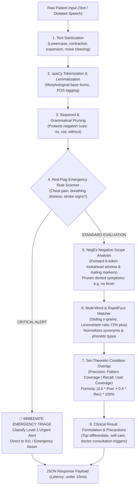

# MedNLP — Backend Engine (FastAPI + spaCy)

The backend service for **MedNLP** is a high-performance, deterministic conversational NLP intelligence engine built using **Python 3.13**, **FastAPI**, and **Uvicorn (ASGI)**. It processes unconstrained clinical symptom descriptions in natural language and executes rule-based triage without external cloud LLM dependencies.

---

## 🌟 Key Features

* **Sub-15ms Latency:** Local in-memory inference pipeline with zero external API calls or GPU overhead.
* **spaCy Linguistic Pipeline:** Statistical tokenization, Part-of-Speech tagging, and lemmatization using `en_core_web_sm`.
* **Clinical NegEx Negation Detection:** Contextual forward and backward scope analysis recognizing denied symptoms across coordinated comma lists (e.g. *"no cough, cold, or fever"*) and clinical shorthand (*"fever: none"*).
* **Fuzzy & Phonetic Matching:** RapidFuzz token sort ratio algorithm normalizing patient misspellings (e.g. *"hedache"* $\rightarrow$ `headache`).
* **Deterministic Overlap Triage:** Set-theoretic precision/recall scoring over 20 structured condition patterns.
* **Red-Flag Emergency Guardrails:** Instant emergency classification for life-threatening symptoms (e.g. severe chest pain, shortness of breath).
* **SQLite Persistence:** Stores consultations with query texts, detected symptoms, top conditions, latency, and emergency alerts.
* **Data Export Endpoints:** Direct CSV and JSON streaming exports for physician review.

---

## 🔄 8-Stage NLP Clinical Processing Flowchart



---

## 🛠️ Technology Stack

| Component | Library / Framework | Version |
| :--- | :--- | :--- |
| **API Framework** | [FastAPI](https://fastapi.tiangolo.com/) | 0.115+ |
| **ASGI Server** | [Uvicorn](https://www.uvicorn.org/) | 0.30+ |
| **Linguistic NLP** | [spaCy](https://spacy.io/) (`en_core_web_sm`) | 3.8+ |
| **String Similarity** | [RapidFuzz](https://github.com/rapidfuzz/RapidFuzz) | 3.14+ |
| **Database & ORM** | [SQLAlchemy](https://www.sqlalchemy.org/) + SQLite 3 | 2.0+ |
| **Schema Validation** | [Pydantic v2](https://docs.pydantic.dev/) | 2.9+ |

---

## 📡 REST API Endpoints

| Method | Endpoint | Description |
| :--- | :--- | :--- |
| `GET` | `/api/health` | System health check (database, NLP pipeline, engine status). |
| `GET` | `/api/stats` | Dashboard metrics (total analyses, unique symptoms, conditions, avg latency). |
| `POST` | `/api/analyze` | Main consultation endpoint — parses text, extracts symptoms, logs to SQLite, returns triage. |
| `POST` | `/api/nlp/process` | Dedicated sandbox endpoint for pipeline visualization (does not save to database). |
| `GET` | `/api/history` | Retrieves paginated history of past consultations. |
| `GET` | `/api/history/{id}` | Detailed deep-dive of a single consultation record. |
| `GET` | `/api/history/export?format=csv\|json` | Downloads past history as formatted CSV or JSON file. |
| `DELETE` | `/api/history/{id}` | Deletes a specific history record. |
| `DELETE` | `/api/history` | Clears all history records. |
| `GET` | `/api/knowledge-base` | Returns condition patterns, symptoms, and categories. |
| `GET` | `/api/knowledge-base/{name}` | Returns clinical profile, precautions, and when to consult for a condition. |

---

## 🚀 Getting Started

### 1. Create Virtual Environment
```bash
python -m venv venv

# Windows
venv\Scripts\activate

# Linux / macOS
source venv/bin/activate
```

### 2. Install Dependencies
```bash
pip install -r requirements.txt
python -m spacy download en_core_web_sm
```

### 3. Run Automated Test Suite
```bash
python test_api.py
```
Executes comprehensive integration tests across all endpoints, negation scopes, emergency triggers, and database transactions.

### 4. Start API Server
```bash
uvicorn app.main:app --reload --port 8000
```
* **API Address:** [http://localhost:8000](http://localhost:8000)
* **Interactive Docs (Swagger):** [http://localhost:8000/docs](http://localhost:8000/docs)
* **Alternative Docs (ReDoc):** [http://localhost:8000/redoc](http://localhost:8000/redoc)
