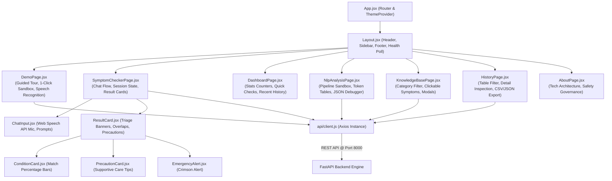

# MedNLP — Frontend Client (React 19 + Vite)

The frontend for **MedNLP** is a modern, responsive Single Page Application (SPA) built with **React 19**, **Vite**, and **Tailwind CSS v4**. It features interactive speech-to-text dictation, real-time clinical triage displays, an 8-stage NLP pipeline inspector, and an interactive demo sandbox.

---

## 🌟 Key Features

* **Interactive Demo & User Guide (`/demo`):** Step-by-step visual tutorial for new users and an interactive sandbox with 1-click clinical presets (Flu, Negation, Red-Flag Emergency, Gastric, Typo).
* **Conversational Symptom Checker (`/checker`):** Natural language chat interface with quick suggestion starter chips, real-time processing indicator, and triage badges.
* **Hands-Free Voice Dictation:** Integrated native Web Speech API recognition in both chat and sandbox inputs with cumulative transcript deduplication.
* **Interactive Knowledge Base (`/knowledge-base`):** Catalog of 20 verified condition patterns with clickable symptom tags that filter conditions on the fly.
* **NLP Pipeline Inspector (`/nlp-analysis`):** Live 8-stage breakdown displaying tokenization, lemmatization, POS tags, RapidFuzz match scores, NegEx negation scope, and differential ranking.
* **Health History & Clinical Exports (`/history`):** Complete log of past consultations with search, detail modal, and one-click **CSV and JSON data downloads**.
* **Engine Health Status:** Real-time health monitoring badge in the sidebar with live latency checks to port 8000.
* **Accessible Theming:** Full Light / Dark mode support with persistent local storage.

---

## 📸 User Interface Snapshots

| Interactive Demo & Guided Tour (`/demo`) | Symptom Checker & Voice Dictation (`/checker`) |
| :---: | :---: |
|  |  |

| Health Analytics Dashboard (`/`) | NLP Pipeline Inspector (`/nlp-analysis`) |
| :---: | :---: |
|  |  |

---

## 🔄 Component Interaction Flowchart



---

## 🛠️ Technology Stack

| Layer | Technology |
| :--- | :--- |
| **Framework** | [React 19](https://react.dev/) |
| **Build Tool & Bundler** | [Vite 8](https://vite.dev/) |
| **Styling** | [Tailwind CSS v4](https://tailwindcss.com/) |
| **Icons** | [Lucide React](https://lucide.dev/) |
| **Routing** | [React Router v6](https://reactrouter.com/) |
| **HTTP Client** | [Axios](https://axios-http.com/) |
| **Linter** | [Oxlint](https://oxc.rs/) |

---

## 📁 Directory Structure

```text
frontend/
├── public/                 # Static assets, favicon, SVGs
├── src/
│   ├── api/
│   │   └── client.js       # Axios client & FastAPI endpoints helper
│   ├── assets/             # Brand logos & graphics
│   ├── components/
│   │   ├── chatbot/        # ChatMessage, ChatInput, ProcessingIndicator, ResultCard
│   │   ├── common/         # StatCard, SymptomChip, ConditionCard, PrecautionCard, EmergencyAlert, Modal
│   │   ├── layout/         # Layout, Header, Sidebar, Footer
│   │   └── nlp/            # PipelineVisualizer, TokenViewer
│   ├── context/
│   │   └── ThemeContext.jsx# Dark / Light theme provider
│   ├── pages/
│   │   ├── DashboardPage.jsx
│   │   ├── DemoPage.jsx
│   │   ├── SymptomCheckerPage.jsx
│   │   ├── NlpAnalysisPage.jsx
│   │   ├── HistoryPage.jsx
│   │   ├── KnowledgeBasePage.jsx
│   │   └── AboutPage.jsx
│   ├── App.jsx             # Route definitions
│   ├── main.jsx            # Application entrypoint
│   └── index.css           # Global Tailwind styling
├── index.html
├── package.json
└── vite.config.js
```

---

## 🚀 Getting Started

### 1. Install Dependencies
```bash
npm install
```

### 2. Environment Configuration
Copy `.env.example` to `.env`:
```bash
cp .env.example .env
```
Default content:
```env
VITE_API_URL=http://localhost:8000
```

### 3. Start Development Server
```bash
npm run dev
```
Open [http://localhost:5173](http://localhost:5173) in your browser.

### 4. Build for Production
```bash
npm run build
```
Creates an optimized, production-ready bundle in `dist/`.

### 5. Run Linter
```bash
npm run lint
```
Runs Oxlint for high-speed static code analysis.
